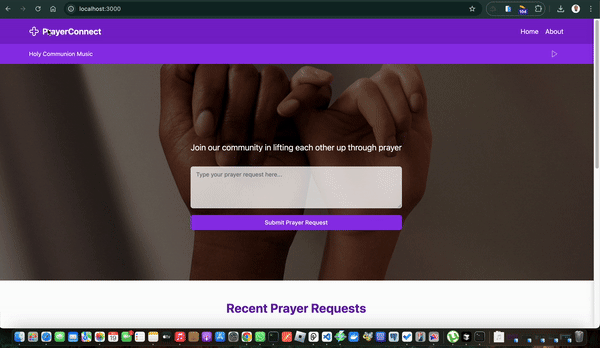

## Sneak Peek



# React Secure Password Generator

## Description

>PrayerConnect is a web application designed to bring people together through the power of prayer. It provides a platform for users to anonymously submit prayer requests and pray for others, fostering a supportive online community.

## Live Demo Link

[Project Live Link](https://next-prayer-connect-8su5zfhw9-white3ds-projects.vercel.app)


## 🛠️ Built With

- [React](https://reactjs.org/)
- [Next.js](https://nextjs.org/)
- [Tailwind CSS](https://tailwindcss.com/)
- [shadcn/ui](https://ui.shadcn.com/)
- [Framer Motion](https://www.framer.com/motion/)
- [GSAP](https://greensock.com/gsap/)
- [Lucide React](https://lucide.dev/)

## 🌟 Key Features

- Anonymous prayer request submissions
- Interactive prayer cards with real-time prayer counters
- Soothing background music player
- Responsive design for all devices
- Social sharing capabilities

## Get Started

### Run

```
To get a clone of the project, run `https://github.com/odhiambo-ed/next-prayer-connect.git`
```

```
cd /next-prayer-connect
```

```
npm install
```

```
npm run dev
```


## Author(s)

  <a href="https://github.com/odhiambo-ed" target="blank"></a>   **Edward Odhiambo**

- GitHub: [@whit3d](https://github.com/odhiambo-ed)
- Twitter: [@odhiambo_ed](https://twitter.com/odhiambo_ed)
- LinkedIn: [Edward Odhiambo](https://www.linkedin.com/in/edward-odhiambo/)
- Portfolio: [Edward Odhiambo](https://edwardodhiambo.com/)

## 🤝 Contributing

Contributions, issues, and feature requests are welcome!!!

Feel free to check the [issues page](https://github.com/odhiambo-ed/next-prayer-connect/issues)

## Show your support

Give a ⭐️ if you like this project!

## Acknowledgments

- Hat tip to anyone whose code was used
- Special thanks to [React](https://react.dev/) for the amazing vanilla JavaScript framework project. I am grateful for your talent and generosity in sharing your work with the community.

## 📝 License

This project is [MIT](https://github.com/white3d/GitHub-User-Content/blob/main/LICENSE) licensed.

